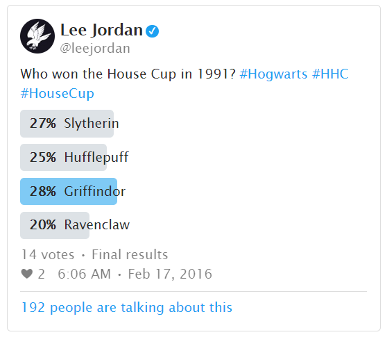
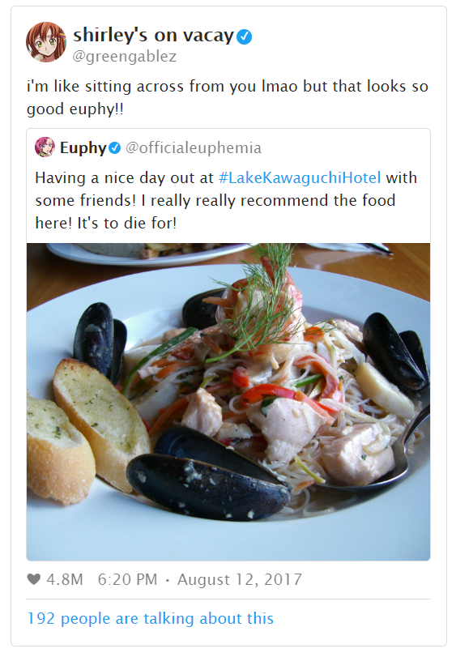

# AO3 Tweet Builder

A user friendly interface to help AO3 writers create fake social media posts using
work skins and some extra HTML. Its companion Tweet work skin was made to
help writers mimic social media experiences in their stories or preserve
fanfiction written on Twitter. No coding necessary.

By entering into a form, users can easily build HTML code that mimics social
media posts from Twitter, including embedded images, quoted tweets, and even polls.

## Getting Started

The project is already up and running, so there is no need to install anything.
However, the user is advised to have certain resources ready before using this site.

Keep in mind that this site is a static page and not meant to host or save the
user's work. Images must be hosted elsewhere and ready to be linked.

## Built With

* [Bootstrap 4](https://getbootstrap.com/) - Web Framework
* [clipboard.js](https://clipboardjs.com/) - Enables users to copy code to clipboard
* [DOMPurify.js](https://github.com/cure53/DOMPurify) - Used to sanitize user inputs
* [Material Design Icons](https://material.io/resources/icons/?style=baseline) - Icons provided by Google

<!-- ## Contributing

Please read [CONTRIBUTING.md](https://gist.github.com/PurpleBooth/b24679402957c63ec426) for details on our code of conduct, and the process for submitting pull requests to us.

## Versioning

We use [SemVer](http://semver.org/) for versioning. For the versions available, see the [tags on this repository](https://github.com/your/project/tags). -->

## Authors

* **Kim Dang** - *Initial work* - [ktddaeng](https://github.com/ktddaeng)

## License

This project is licensed under the MIT License - see the [LICENSE.md](LICENSE.md) file for details
